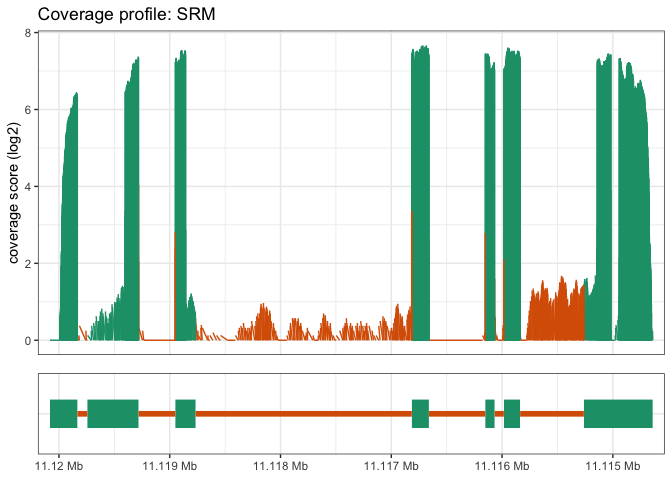
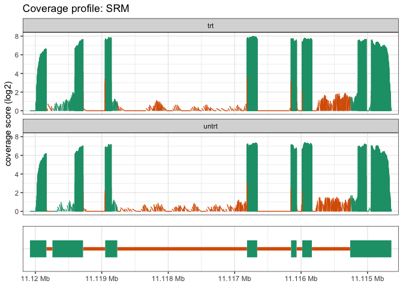

<!-- README.md is generated from README.Rmd. Please edit that file -->

# superintronic

[](https://www.tidyverse.org/lifecycle/#experimental)
[](https://travis-ci.org/sa-lee/superintronic)
[](https://ci.appveyor.com/project/sa-lee/superintronic)
[](https://codecov.io/gh/sa-lee/superintronic?branch=master)

Exploring coverage signal in high-throughput (RNA) sequencing data via
coverage estimation.

*superintronic* centers around exploring coverage over exonic and
intronic regions via computing simple summary statistics and
visualisations. The aim is to provide an extremely modular worklfow via
an interface built on top of the
[*plyranges*](https://sa-lee.github.io/plyranges/index.html) package.
This means that you can modify any of the steps provided with the
*plyranges* grammar or just use our defaults.

The basic workflow consists of three steps

1.  Setting up annotations
2.  Computing coverage
3.  Visualising coverage results

## Setting up annotation GRanges

We assume you are starting from a GTF/GFF file for your given organism.
The reading of the GFF file is done external to this package, and can be
done via `rtracklayer::import` or `plyranges::read_gff`. The resulting
GRanges is passed to `collect_parts()`, then you can use
`plyranges::filter()` to select the criteria for genes you’re interested
in.

Alternatively, since `collect_parts()` is a generic we can also start
from any of the following objects:

  - character vector containing a path to GFF file
  - GFF/GTFFile class from `rtracklayer`
  - TxDb and related Bioconductor

`collect_parts()` computes a `GRanges` with number of rows equal to
genes, it only considers intronic/exonic parts linked to a single gene
only.

The result is a GRanges object with number of rows equal to genes, and
columns containing the intronic and exonic features (as list columns)
and the number of times a gene overlaps anyother feature (as well as any
associated information from the gtf file).

``` r
library(superintronic)
#> Registered S3 methods overwritten by 'ggplot2':
#>   method         from 
#>   [.quosures     rlang
#>   c.quosures     rlang
#>   print.quosures rlang
library(magrittr)
library(plyranges)
#> Loading required package: BiocGenerics
#> Loading required package: parallel
#> 
#> Attaching package: 'BiocGenerics'
#> The following objects are masked from 'package:parallel':
#> 
#>     clusterApply, clusterApplyLB, clusterCall, clusterEvalQ,
#>     clusterExport, clusterMap, parApply, parCapply, parLapply,
#>     parLapplyLB, parRapply, parSapply, parSapplyLB
#> The following objects are masked from 'package:stats':
#> 
#>     IQR, mad, sd, var, xtabs
#> The following objects are masked from 'package:base':
#> 
#>     anyDuplicated, append, as.data.frame, basename, cbind,
#>     colnames, dirname, do.call, duplicated, eval, evalq, Filter,
#>     Find, get, grep, grepl, intersect, is.unsorted, lapply, Map,
#>     mapply, match, mget, order, paste, pmax, pmax.int, pmin,
#>     pmin.int, Position, rank, rbind, Reduce, rownames, sapply,
#>     setdiff, sort, table, tapply, union, unique, unsplit, which,
#>     which.max, which.min
#> Loading required package: IRanges
#> Loading required package: S4Vectors
#> Loading required package: stats4
#> 
#> Attaching package: 'S4Vectors'
#> The following object is masked from 'package:base':
#> 
#>     expand.grid
#> Loading required package: GenomicRanges
#> Loading required package: GenomeInfoDb
#> 
#> Attaching package: 'plyranges'
#> The following object is masked from 'package:stats':
#> 
#>     filter

features <- system.file("extdata", 
                        "Homo_sapiens.GRCh37.75_subset.gtf", 
                        package = "airway") %>% 
  collect_parts() %>% 
  filter(source == "protein_coding", n_olaps == 1)

features
#> GRanges object with 3 ranges and 9 metadata columns:
#>       seqnames            ranges strand |         gene_id   gene_name
#>          <Rle>         <IRanges>  <Rle> |           <Rle> <character>
#>   [1]        1 11114641-11120081      - | ENSG00000116649         SRM
#>   [2]        1 11072414-11085796      + | ENSG00000120948      TARDBP
#>   [3]        1 11006528-11042094      - | ENSG00000175262    C1orf127
#>          gene_source   gene_biotype     type         source   n_olaps
#>          <character>    <character> <factor>       <factor> <integer>
#>   [1] ensembl_havana protein_coding     gene protein_coding         1
#>   [2] ensembl_havana protein_coding     gene protein_coding         1
#>   [3] ensembl_havana protein_coding     gene protein_coding         1
#>                                                                exonic_parts
#>                                                               <GRangesList>
#>   [1] 1:11114641-11115261:-,1:11115838-11115983:-,1:11116068-11116151:-,...
#>   [2] 1:11072414-11072485:+,1:11072699-11072800:+,1:11073773-11074022:+,...
#>   [3] 1:11006528-11006798:-,1:11007700-11009871:-,1:11014076-11014199:-,...
#>                                                              intronic_parts
#>                                                               <GRangesList>
#>   [1] 1:11115262-11115837:-,1:11115984-11116067:-,1:11116152-11116660:-,...
#>   [2] 1:11072486-11072698:+,1:11072801-11073772:+,1:11074023-11075580:+,...
#>   [3] 1:11006799-11007699:-,1:11009872-11014075:-,1:11014200-11015046:-,...
#>   -------
#>   seqinfo: 1 sequence from an unspecified genome; no seqlengths
```

## Computing coverage over BAM(s)

### Making coverage scores into a tidy GRanges

Here we compute a long form GRanges containing coverage scores in
parallel over a set of BAM files. We have structured it so you specify a
data frame, (like you would get from targets in `limma`), that contains
a column identified by `source`, that specifies the BAM file names.
Other options include specifying a GRanges that represents the genome
build, an optional target GRanges for restricting coverage (requiring
the BAM to be indexed), an argument for dropping entire regions that
have zero coverage, and an argumet for parallel computations.

``` r
# signature (dispatch on spec and source)
compute_coverage_long(spec,
                      source,
                      .target = NULL,
                      .genome_info = NULL,
                      .drop_empty = TRUE
                      .parallel = BiocParallel::bpparam()
                      )
```

This function automatically propagates, the metadata associated with a
design onto the resulting GRanges, however a user may also just provide
a vector of BAM files and then add any relevant design variables later
with `join_design()`.

As an example, let’s use BAM files from the
[`airway`](https://bioconductor.org/packages/release/data/experiment/html/airway.html)
data package.

``` r
design <- read.csv(system.file("extdata", 
                               "sample_table.csv", 
                               package = "airway")) %>% 
  dplyr::select(sample_id = X, cell, dex, albut) %>% 
  dplyr::mutate(bam = dir(system.file("extdata", package = "airway"), 
                          pattern = "*.bam",
                          full.names = TRUE)
  )

cvg <- compute_coverage_long(design, source = "bam")
cvg
#> GRanges object with 98561 ranges and 6 metadata columns:
#>           seqnames             ranges strand |  sample_id     cell
#>              <Rle>          <IRanges>  <Rle> |   <factor> <factor>
#>       [1]        1         1-11053772      * | SRR1039508   N61311
#>       [2]        1  11053773-11053835      * | SRR1039508   N61311
#>       [3]        1  11053836-11053839      * | SRR1039508   N61311
#>       [4]        1  11053840-11053902      * | SRR1039508   N61311
#>       [5]        1  11053903-11067865      * | SRR1039508   N61311
#>       ...      ...                ...    ... .        ...      ...
#>   [98557]        1  11359548-11362328      * | SRR1039521  N061011
#>   [98558]        1  11362329-11362356      * | SRR1039521  N061011
#>   [98559]        1  11362357-11362391      * | SRR1039521  N061011
#>   [98560]        1  11362392-11362419      * | SRR1039521  N061011
#>   [98561]        1 11362420-249250621      * | SRR1039521  N061011
#>                dex    albut
#>           <factor> <factor>
#>       [1]    untrt    untrt
#>       [2]    untrt    untrt
#>       [3]    untrt    untrt
#>       [4]    untrt    untrt
#>       [5]    untrt    untrt
#>       ...      ...      ...
#>   [98557]      trt    untrt
#>   [98558]      trt    untrt
#>   [98559]      trt    untrt
#>   [98560]      trt    untrt
#>   [98561]      trt    untrt
#>                                                                                                           bam
#>                                                                                                         <Rle>
#>       [1] /Library/Frameworks/R.framework/Versions/3.6/Resources/library/airway/extdata/SRR1039508_subset.bam
#>       [2] /Library/Frameworks/R.framework/Versions/3.6/Resources/library/airway/extdata/SRR1039508_subset.bam
#>       [3] /Library/Frameworks/R.framework/Versions/3.6/Resources/library/airway/extdata/SRR1039508_subset.bam
#>       [4] /Library/Frameworks/R.framework/Versions/3.6/Resources/library/airway/extdata/SRR1039508_subset.bam
#>       [5] /Library/Frameworks/R.framework/Versions/3.6/Resources/library/airway/extdata/SRR1039508_subset.bam
#>       ...                                                                                                 ...
#>   [98557] /Library/Frameworks/R.framework/Versions/3.6/Resources/library/airway/extdata/SRR1039521_subset.bam
#>   [98558] /Library/Frameworks/R.framework/Versions/3.6/Resources/library/airway/extdata/SRR1039521_subset.bam
#>   [98559] /Library/Frameworks/R.framework/Versions/3.6/Resources/library/airway/extdata/SRR1039521_subset.bam
#>   [98560] /Library/Frameworks/R.framework/Versions/3.6/Resources/library/airway/extdata/SRR1039521_subset.bam
#>   [98561] /Library/Frameworks/R.framework/Versions/3.6/Resources/library/airway/extdata/SRR1039521_subset.bam
#>               score
#>           <integer>
#>       [1]         0
#>       [2]         1
#>       [3]         0
#>       [4]         1
#>       [5]         0
#>       ...       ...
#>   [98557]         0
#>   [98558]         1
#>   [98559]         2
#>   [98560]         1
#>   [98561]         0
#>   -------
#>   seqinfo: 84 sequences from an unspecified genome
```

Once the coverage is in long form, we can then merge overlapping genomic
features over the experimental design via an intersect overlap join and
nesting over the union ranges of an index index (usually gene\_id).

``` r
cvg_over_features <- nest_by_overlaps(cvg,
                                      features, 
                                      .key = dplyr::vars(sample_id),
                                      .index = dplyr::vars(gene_id)
)

cvg_over_features
#> GRanges object with 24 ranges and 4 metadata columns:
#>        seqnames            ranges strand |         gene_id  sample_id
#>           <Rle>         <IRanges>  <Rle> |           <Rle>   <factor>
#>    [1]        1 11114641-11120081      * | ENSG00000116649 SRR1039508
#>    [2]        1 11114641-11120081      * | ENSG00000116649 SRR1039509
#>    [3]        1 11114641-11120081      * | ENSG00000116649 SRR1039512
#>    [4]        1 11114641-11120081      * | ENSG00000116649 SRR1039513
#>    [5]        1 11114641-11120081      * | ENSG00000116649 SRR1039516
#>    ...      ...               ...    ... .             ...        ...
#>   [20]        1 11006528-11042094      * | ENSG00000175262 SRR1039513
#>   [21]        1 11006528-11042094      * | ENSG00000175262 SRR1039516
#>   [22]        1 11006528-11042094      * | ENSG00000175262 SRR1039517
#>   [23]        1 11006528-11042094      * | ENSG00000175262 SRR1039520
#>   [24]        1 11006528-11042094      * | ENSG00000175262 SRR1039521
#>                 n_bases         score
#>           <IntegerList> <IntegerList>
#>    [1]       12,1,1,...     0,1,2,...
#>    [2]       10,3,1,...     0,1,3,...
#>    [3]       9,9,11,...     0,1,2,...
#>    [4]       11,2,3,...     0,1,2,...
#>    [5]        2,8,3,...     1,0,2,...
#>    ...              ...           ...
#>   [20]  271,901,935,...     0,0,0,...
#>   [21] 271,901,2172,...     0,0,0,...
#>   [22] 271,901,2172,...     0,0,0,...
#>   [23]  271,901,558,...     0,0,0,...
#>   [24] 271,901,2172,...     0,0,0,...
#>   -------
#>   seqinfo: 84 sequences from an unspecified genome
```

### Computing coverage wide form

Returns a `RaggedExperiment` object (useful for doing things like PCA,
CCA more of a bioconductor approach etc.)

``` r
compute_coverage_wide(design,
                      source,
                      .target = GenomicRanges::GRanges(),
                      .genome_info,
                      .parallel = BiocParallel::bpparam()
                      )
```

## Rangewise diagnostics

We can then compute a bunch of `rangostics` (name TBD), over a given
(key and index) accross a column representing the coverage score.

  - mean
  - min, median, max
  - quantile
  - variance
  - variance\_shift
  - bases\_above\_score
  - near\_feature\_*covnostic*

Includes functions for purrr like mapping for sliding/tiling/stretching
over genomic windows.

This is conceptually similar to `dplyr::summarise_at`

``` r
rango(cvg_over_features, y = score, wt = width, .funs, ...)
```

## Visualising coverage scores

Options for visualising coverage over a given range

``` r
cvg_over_features <- join_parts(cvg, features) 

cvg_over_features %>% 
  view_coverage(., filter(features, gene_id == "ENSG00000116649"))
```



``` r

cvg_over_features %>% 
  view_coverage(., filter(features, gene_id == "ENSG00000116649"),
                facets = dplyr::vars(dex))
```



This returns a regular old ggplot object, so segments can be overlaid
with by adding to the plot object.
