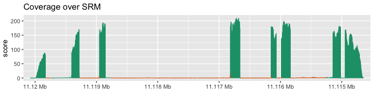
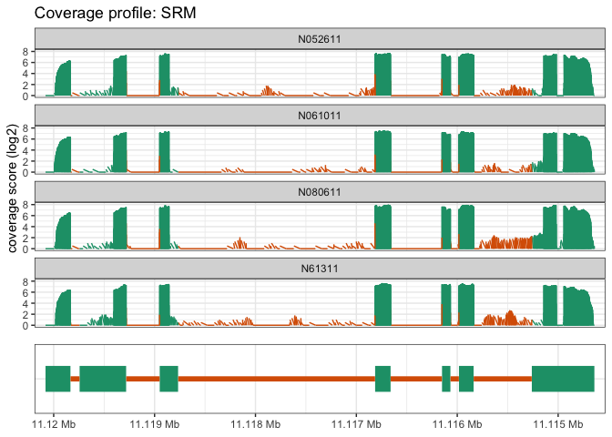
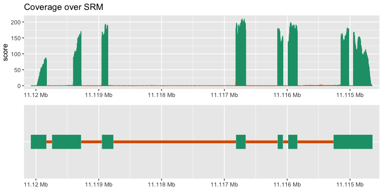
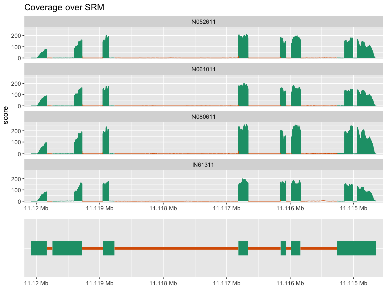

<!-- README.md is generated from README.Rmd. Please edit that file -->

# superintronic 

[](https://www.tidyverse.org/lifecycle/#experimental)
[](https://travis-ci.org/sa-lee/superintronic)
[](https://ci.appveyor.com/project/sa-lee/superintronic)
[](https://codecov.io/gh/sa-lee/superintronic?branch=master)

*superintronic* centers around exploring coverage over genomic regions
via computing simple summary statistics and visualisations. The aim is
to provide a modular worklfow via an interface built on top of the
[*plyranges*](https://sa-lee.github.io/plyranges/index.html) package and
emphasising simple

## Quick start

Often, as quality control check in sequencing analysis you would like to
visualise coverage within each sample over the exon/intron parts of gene
of interest. This is simple with superintronic\!

As an example, we will use the sample BAM files from the
[`airway`](https://bioconductor.org/packages/release/data/experiment/html/airway.html)
data package in Bioconductor and our target gene is *SRM*

The basic workflow consists of three steps

1.  Setting up your gene region of interest
2.  Computing coverage
3.  Visualising coverage results

(*Note that we are considering a single gene for illustrative purposes
and in principle you can look at coverage over any genomic region you’re
interested in\!*)

### 1\. Setting up annotation GRanges

You can start from a GTF/GFF file for your given organism and
`collect_parts()` to gather up the intronic/exonic regions for each
gene. You can then use the *plyranges* grammar to select your target
gene.

``` r
library(superintronic)
#> Warning: replacing previous import 'IRanges::slice' by 'plyranges::slice' when
#> loading 'superintronic'
suppressPackageStartupMessages(library(plyranges))

features <- system.file("extdata", 
                        "Homo_sapiens.GRCh37.75_subset.gtf", 
                        package = "airway") %>% 
  collect_parts() %>% 
  filter(gene_name == "SRM")

features
#> GRanges object with 1 range and 9 metadata columns:
#>       seqnames            ranges strand |         gene_id   gene_name
#>          <Rle>         <IRanges>  <Rle> |           <Rle> <character>
#>   [1]        1 11114641-11120081      - | ENSG00000116649         SRM
#>          gene_source   gene_biotype     type         source   n_olaps
#>          <character>    <character> <factor>       <factor> <integer>
#>   [1] ensembl_havana protein_coding     gene protein_coding         1
#>                                                                exonic_parts
#>                                                               <GRangesList>
#>   [1] 1:11114641-11115261:-,1:11115838-11115983:-,1:11116068-11116151:-,...
#>                                                              intronic_parts
#>                                                               <GRangesList>
#>   [1] 1:11115262-11115837:-,1:11115984-11116067:-,1:11116152-11116660:-,...
#>   -------
#>   seqinfo: 1 sequence from an unspecified genome; no seqlengths
```

### 2\. Computing coverage over samples

You can compute a long form GRanges containing coverage scores in
parallel over a set of BAM files. All you need to begin is a character
vector containing the path the BAM files or a `data.frame` representing
the experimental design that contains a column of BAM files.

``` r
design <- read.csv(system.file("extdata", 
                               "sample_table.csv", 
                               package = "airway")) %>% 
  dplyr::select(sample_id = X, cell, dex, albut) %>% 
  dplyr::mutate(bam = dir(system.file("extdata", package = "airway"), 
                          pattern = "*.bam",
                          full.names = TRUE)
  )

cvg <- compute_coverage_long(design, source = "bam")

cvg 
#> GRanges object with 98561 ranges and 6 metadata columns:
#>           seqnames             ranges strand |  sample_id     cell      dex
#>              <Rle>          <IRanges>  <Rle> |   <factor> <factor> <factor>
#>       [1]        1         1-11053772      * | SRR1039508   N61311    untrt
#>       [2]        1  11053773-11053835      * | SRR1039508   N61311    untrt
#>       [3]        1  11053836-11053839      * | SRR1039508   N61311    untrt
#>       [4]        1  11053840-11053902      * | SRR1039508   N61311    untrt
#>       [5]        1  11053903-11067865      * | SRR1039508   N61311    untrt
#>       ...      ...                ...    ... .        ...      ...      ...
#>   [98557]        1  11359548-11362328      * | SRR1039521  N061011      trt
#>   [98558]        1  11362329-11362356      * | SRR1039521  N061011      trt
#>   [98559]        1  11362357-11362391      * | SRR1039521  N061011      trt
#>   [98560]        1  11362392-11362419      * | SRR1039521  N061011      trt
#>   [98561]        1 11362420-249250621      * | SRR1039521  N061011      trt
#>              albut
#>           <factor>
#>       [1]    untrt
#>       [2]    untrt
#>       [3]    untrt
#>       [4]    untrt
#>       [5]    untrt
#>       ...      ...
#>   [98557]    untrt
#>   [98558]    untrt
#>   [98559]    untrt
#>   [98560]    untrt
#>   [98561]    untrt
#>                                                                                                           bam
#>                                                                                                         <Rle>
#>       [1] /Library/Frameworks/R.framework/Versions/3.6/Resources/library/airway/extdata/SRR1039508_subset.bam
#>       [2] /Library/Frameworks/R.framework/Versions/3.6/Resources/library/airway/extdata/SRR1039508_subset.bam
#>       [3] /Library/Frameworks/R.framework/Versions/3.6/Resources/library/airway/extdata/SRR1039508_subset.bam
#>       [4] /Library/Frameworks/R.framework/Versions/3.6/Resources/library/airway/extdata/SRR1039508_subset.bam
#>       [5] /Library/Frameworks/R.framework/Versions/3.6/Resources/library/airway/extdata/SRR1039508_subset.bam
#>       ...                                                                                                 ...
#>   [98557] /Library/Frameworks/R.framework/Versions/3.6/Resources/library/airway/extdata/SRR1039521_subset.bam
#>   [98558] /Library/Frameworks/R.framework/Versions/3.6/Resources/library/airway/extdata/SRR1039521_subset.bam
#>   [98559] /Library/Frameworks/R.framework/Versions/3.6/Resources/library/airway/extdata/SRR1039521_subset.bam
#>   [98560] /Library/Frameworks/R.framework/Versions/3.6/Resources/library/airway/extdata/SRR1039521_subset.bam
#>   [98561] /Library/Frameworks/R.framework/Versions/3.6/Resources/library/airway/extdata/SRR1039521_subset.bam
#>               score
#>           <integer>
#>       [1]         0
#>       [2]         1
#>       [3]         0
#>       [4]         1
#>       [5]         0
#>       ...       ...
#>   [98557]         0
#>   [98558]         1
#>   [98559]         2
#>   [98560]         1
#>   [98561]         0
#>   -------
#>   seqinfo: 84 sequences from an unspecified genome
```

This function automatically propagates, the metadata associated with a
design onto the resulting GRanges. You can speed up this computation if
your BAM files are indexed by providing a target GRanges so coverage
will be restricted to that set of ranges only.

Once the coverage has been computed as a GRanges object, we can then
intersect overlapping gene parts (from `collect_parts()`)

``` r
cvg_over_features <- cvg %>% 
  select(-bam) %>% 
  join_parts(features)
cvg_over_features
#> GRanges object with 7886 ranges and 10 metadata columns:
#>          seqnames            ranges strand |  sample_id     cell      dex
#>             <Rle>         <IRanges>  <Rle> |   <factor> <factor> <factor>
#>      [1]        1 11114641-11114652      * | SRR1039508   N61311    untrt
#>      [2]        1          11114653      * | SRR1039508   N61311    untrt
#>      [3]        1          11114654      * | SRR1039508   N61311    untrt
#>      [4]        1 11114655-11114656      * | SRR1039508   N61311    untrt
#>      [5]        1 11114657-11114662      * | SRR1039508   N61311    untrt
#>      ...      ...               ...    ... .        ...      ...      ...
#>   [7882]        1 11119982-11119986      * | SRR1039521  N061011      trt
#>   [7883]        1 11119987-11119989      * | SRR1039521  N061011      trt
#>   [7884]        1 11119990-11119991      * | SRR1039521  N061011      trt
#>   [7885]        1 11119992-11119993      * | SRR1039521  N061011      trt
#>   [7886]        1 11119994-11120081      * | SRR1039521  N061011      trt
#>             albut     score         gene_id feature_type feature_rank
#>          <factor> <integer>           <Rle>        <Rle>    <integer>
#>      [1]    untrt         0 ENSG00000116649         exon            1
#>      [2]    untrt         1 ENSG00000116649         exon            1
#>      [3]    untrt         2 ENSG00000116649         exon            1
#>      [4]    untrt         3 ENSG00000116649         exon            1
#>      [5]    untrt         6 ENSG00000116649         exon            1
#>      ...      ...       ...             ...          ...          ...
#>   [7882]    untrt         4 ENSG00000116649         exon            7
#>   [7883]    untrt         3 ENSG00000116649         exon            7
#>   [7884]    untrt         2 ENSG00000116649         exon            7
#>   [7885]    untrt         1 ENSG00000116649         exon            7
#>   [7886]    untrt         0 ENSG00000116649         exon            7
#>          feature_strand feature_length
#>                   <Rle>      <integer>
#>      [1]              -            621
#>      [2]              -            621
#>      [3]              -            621
#>      [4]              -            621
#>      [5]              -            621
#>      ...            ...            ...
#>   [7882]              -            248
#>   [7883]              -            248
#>   [7884]              -            248
#>   [7885]              -            248
#>   [7886]              -            248
#>   -------
#>   seqinfo: 84 sequences from an unspecified genome
```

Further summaries can then be computed using rangewise diagnostics, see
the `rangle()` function for details.

### 3\. Visualising coverage scores

Coverage over a gene or a genomic region can be constructed via the
`view_coverage()` function. The coverage score is disjoined and
aggregated over all samples that overlaps the target region:

``` r
library(ggplot2)
p <- cvg_over_features %>% 
  mutate(strand = feature_strand) %>% 
  view_coverage(score = score, colour = feature_type) + 
  scale_color_brewer(palette = "Dark2") +
  guides(colour = FALSE) +
  labs(title = "Coverage over SRM")
p
```



By default, the coverage is aligned from the 5’ to the 3’ end of the
target region, and exon regions are coloured green and intron parts are
colour orange (if you have set the strand on the input data, otherwise
coverage is oriented 3’ to 5’).

The function returns a ggplot object, so extra annotations or layers can
be added via the `ggplot2` library.

We can also create track plots to include the gene body by adding in
segments with

``` r
gene_track <- view_segments(unnest_parts(features), 
                            colour = feature_type)
gene_track
```



And via the `patchwork`, generate tracks:

``` r
p / gene_track
```



Coverage scores can also be facetted if additional experimental design
information has been added. For example, we can split the coverage by
each sample or treatment group or cell type

``` r
p <- cvg_over_features %>% 
  mutate(strand = feature_strand) %>% 
  view_coverage(score = score, 
                colour = feature_type, 
                facets = vars(cell)) + 
  scale_color_brewer(palette = "Dark2") +
  guides(colour = FALSE) +
  labs(title = "Coverage over SRM")
p / gene_track + patchwork::plot_layout(heights = c(3, 1))
```



## Learning more

*superintronic* provides a general API to compute not only coverage, but
also aggregate and visualise other measurements of interest over any
arbirtrary genomic region. See the [vignette]() for details and the
[*plyranges*](https://sa-lee.github.io/plyranges/index.html#learning-more)
documentation.
